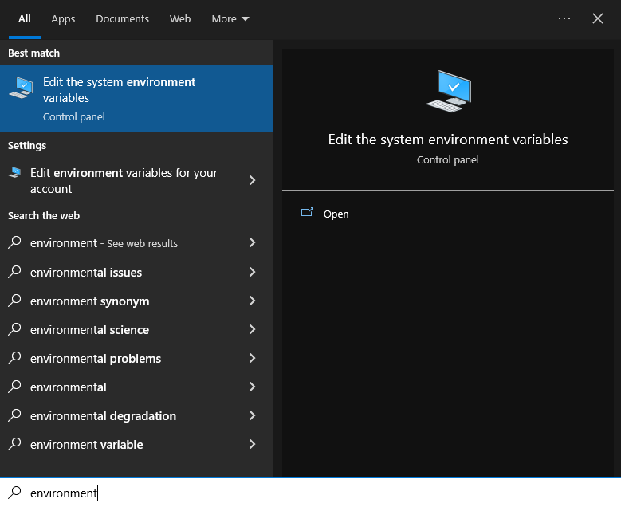
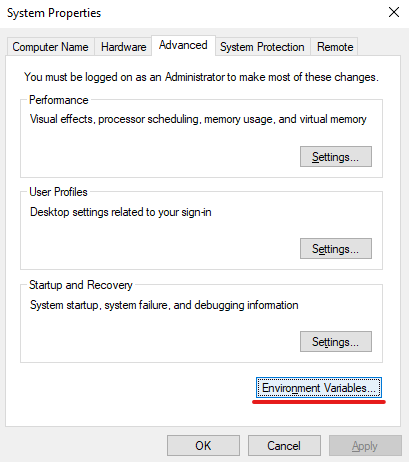
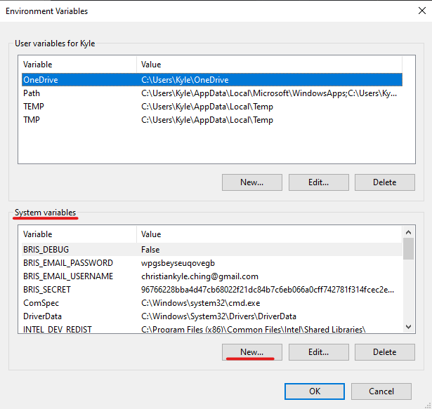
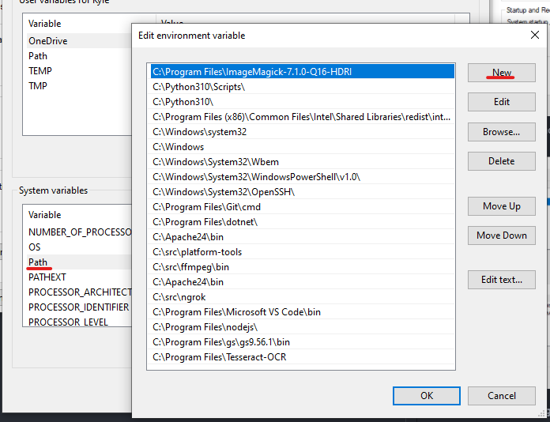
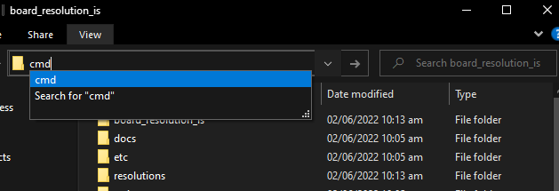

<!-- 
This README is a streamlined version of the [README](/README.md)
that cuts off the steps for development server only.
-->

# PLV Board Resolution System - Installation

This setup guide is for installing the system complete with a web server for serving the site and its files.

This guide is intended for running the server on a **Windows** PC or server.

You'll also need **internet connection** for downloading the required installers for the system (*we recommend that you pre-download these files where internet connection is good*).

## Pre-Requisite Installers

First of all, **this requires a 64-bit Windows PC** (though most PCs are now 64-bit). Follow [these steps](https://support.microsoft.com/en-us/windows/32-bit-and-64-bit-windows-frequently-asked-questions-c6ca9541-8dce-4d48-0415-94a3faa2e13d) to check your System Type. 

You'll also need to be somewhat knowledgable of using the Command Prompt (`cmd`), as we'll need to use it a few times.

In order for you to prepare the installers in advance, here is a list of the pre-requisite installers and their download links:

1. **PLV Board Resolution System Files** - https://github.com/christiankyle-ching/board_resolution_is (Click `Code > Download ZIP`)
2. **Python 3.10** - https://www.python.org/downloads/release/python-3104/ (Select the `Windows installer (64-bit)`)
3. **NodeJS** - https://nodejs.org/en/download/ (Select `LTS > Windows Installer`)
4. **PostgreSQL (Database)** - https://www.enterprisedb.com/downloads/postgres-postgresql-downloads (Select `PostgreSQL Version 14.3 > Windows x86-64`)
5. **Tesseract for Windows** - https://github.com/UB-Mannheim/tesseract/wiki#tesseract-installer-for-windows (Select the `(64-bit)`)
6. **Apache** - https://www.apachelounge.com/download/ (Select `Win64`)
7. **Visual Studio C++ Build Tools** - https://drive.google.com/file/d/1WGwRLyx2mRVLWkLYrU7xb0dJCWCze_Li/view?usp=sharing (*This is an offline installer I prepared for one-click install of C++ Build Tools*)
8. (Optional: For easier code editing) **VSCode** - https://code.visualstudio.com/download

## Installing Softwares

Now that you have all the installers, we'll walk through installing each of the software. Before proceeding, **please install the system using an Administrator account in the Windows PC to avoid conflicts.**

### Python
1. Run the Python installer.
2. **(IMPORTANT)** Use these steps to install your Python!
   1. Check **Add to PATH**.
   2. Click **Custom Install**.
   3. Click **Next**.
   4. Check **Install for All Users**.
   5. **IMPORTANT! Change install location to `C:\Python310` only! Remove the "Program Files"**.
   6. Install and done.
3. Install `pipenv` by:
   1. Open a `cmd`
   2. Enter: `pip install pipenv`

### PostgreSQL Database
**Database Name: `db_board_resolution_is`**

1. Install [PostgreSQL](https://www.postgresql.org/download/).
   - Use the default values (just press `Next`).
   - **NOTE: Remember your password** and make it secure!
2. Create a database by:
   1. Run `psql`. On Windows, search for `psql`.
   2. **Enter your password**.
   3. Run `CREATE DATABASE db_board_resolution_is;`
      - Take note of the semicolon.
   4. Verify if database is created by entering `\l` in `psql`. You should see `db_board_resolution_is` in the databases column.

### NodeJS

Just follow the installer steps of [Node.js](https://nodejs.org/en/download/). No further instructions for now.

### Tesseract OCR

Tesseract OCR is used to detect the text content of the images uploaded. To install, just run the installer and click **Next** a bunch of times.

### Visual Studio C++ Build Tools

1. Extract all the files in [vs_BuildTools.zip](https://drive.google.com/file/d/1WGwRLyx2mRVLWkLYrU7xb0dJCWCze_Li/view?usp=sharing) in the root of `C:\`.
2. Run the `vs_BuildTools_install.bat` (double-click).

*(Alternative) Use online method shown [here](/docs/deploy_windows_apache.md#setup-of-msvc-c-build-tools).*

### Apache (Web Server)

From the `httpd_...zip` (this is the Apache installer), Extract `Apache24` folder directly to `C:\`.

## Setup the System

Now that we've installed all of the required software, now it's time to actually setup the site.

First, we'll need to tell the PC where to locate the programs we installed, then we'll create an Admin account.

### Set Environment Variables

To tell the PC where to locate the programs we installed, we'll need to add several **environment variables** to the system. To add environment variables:

1. Search for "environment" in Windows Search.

2. Select **Environment Variables**.

3. We will be adding variables under the **System Variables**


**Add the following variable names and their values.**

| Variable Name | How to get variable value? |
| --- | --- |
| `NPM_BIN_PATH` | In a `cmd`, enter: `where npm`. Get the value with the `npm.cmd` (Ex. `C:\...\nodejs\npm.cmd`) |
| `PSQL_PASSWORD` | The password you set when installing PostgreSQL. |
| `BRIS_SECRET` | Run this command in a `cmd`: `py -c "import secrets; print(secrets.token_hex(64))"`, then get the value printed |

**Next, still under the System Variables, double click the `PATH`.** We'll need to add some location for the system to properly locate the softwares.



- Add: `C:\Apache24\bin`
- Add: `C:\Program Files\Tesseract-OCR`

#### Password Reset via Email using Gmail App Passwords

For password reset using email, you need to add a **Gmail Account with 2FA enabled**. Gmail is used to send the Password Reset links securely to accounts within the system. [Add an Google App Password](https://support.google.com/accounts/answer/185833?hl=en), and **copy this password**. Then assign the following environment variables:
| Variable Name | How to get variable value? |
| --- | --- |
| `BRIS_EMAIL_USERNAME` | Your Gmail Account (email address) |
| `BRIS_EMAIL_PASSWORD` | The generated App Password |

**Important Note:** If you changed your password on Google, all App Passwords are revoked and you'll need to generate one (and replace the environment variable).

### Setting and Testing the Website

We're on the final steps of setting this up! Here, we need to use the command line (`cmd`).

1. First, extract the `board_resolution_is-main` folder inside the ZIP `board_resolution_is-main.zip` directly to `C:\`. Rename the folder to `board_resolution_is`.
2. Open the folder. Click the folder path above and type `cmd` to open a Command Prompt on that location.

3. Type the following commands in order, one by one:
```bat
pipenv requirements > requirements.txt
pip install -r requirements.txt
py manage.py migrate
py manage.py tailwind install
py manage.py tailwind build
py manage.py collectstatic --noinput
```
4. We'll need to create a default admin account. In the same `cmd` window, enter:
```bat
py manage.py createsuperuser
```
Enter valid credentials that you'll use to log into the system. Also use valid email address in order for reset password feature to work.

5. Next, we'll test first if the installation is working by entering:
```bat
py manage.py runserver
```
Then open the link shown in the browser (default is: `http://127.0.0.1:8000/`)

Once it is confirmed to be working, stop the server by pressing `CTRL + C` in the `cmd`.

### Setting up Apache Web Server (Final Step)

This is the final step. We need to setup the config file for the Apache to properly broadcast the website to LAN.

#### Update httpd.conf

1. Copy the contents of the [template config](/etc/httpd.template.conf), and paste it **at the end of httpd.conf (Default Location: `C:\Apache24\conf\httpd.conf`)**.
2. In a `cmd`, run: `mod_wsgi-express module-config`. Copy the three lines and replace in the `httpd.conf` file (**not in the template, but the one located at `C:\Apache24\conf\httpd.conf`**).

```apacheconf
...

ServerName localhost:80

# TODO: Replace these three lines below by the result of `mod_wsgi-express module-config`
LoadFile ""
LoadModule wsgi_module ""
WSGIPythonHome ""

...
```

#### Setup the Network
Change the IP settings of the server from DHCP (Automatic) to **Static IP**. For Windows: follow this guide (https://docs.microsoft.com/en-us/troubleshoot/windows-server/networking/change-ip-address-network-adapter#how-to-specify-an-ip-address). **Remember this IP** as you'll use this to connect to the site on other devices.

Also make sure that the network you connected is secured, and is set to a **Private Network** in Windows (so that Windows will allow incoming and outgoing connections in LAN). If you're connected via Wireless, then make sure that the Access Point is password-protected so Windows will automatically set it as a **Private Network**.

### Install and Start the Server

In a `cmd` running as Administrator (`WIN + R > Type 'cmd' > CTRL + SHIFT + ENTER`), run the following commands in order, one-by-one:

```bat
httpd -k install
httpd -k start
```

### Verify if it's working
- Use Task Manager to see if `Apache HTTP Server` is running.
- In a `cmd`, enter `ipconfig` and copy your IPv4 Local Address. Visit this IP on a browser and the web app should be visible.

### Troubleshooting
If errors occur, you can check the logs at `C:\Apache24\logs`.

### Register Scheduled Tasks for Regular Cleanup
Using the Backup & Restore within the system generates files that can easily fill the hard drive. **Run the [/scripts/create_task_cleandumps.bat](/scripts/create_task_cleandumps.bat) to Create a Scheduled Task** that clears these temporary folders for Backup & Restore regularly.

### Stop the service (server)
If you ever want to stop (or restart) the server, in a `cmd (Admin)`, enter: `httpd -k stop`.

